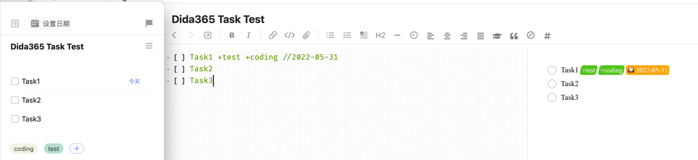

## Dida365 Joplin Plugin

It syncs your conference style todo items to your dida365 applications automatically, and syncs the task status back to joplin from dida365 so that you can enjoy the notification from dida365 and mark task done in dida365.

## Building the plugin

The plugin is built using Webpack, which creates the compiled code in `/dist`. A JPL archive will also be created at the root, which can use to distribute the plugin.

To build the plugin, simply run `npm run dist`.

The project is setup to use TypeScript, although you can change the configuration to use plain JavaScript.

## Updating the plugin framework

To update the plugin framework, run `npm run update`.

In general this command tries to do the right thing - in particular it's going to merge the changes in package.json and .gitignore instead of overwriting. It will also leave "/src" as well as README.md untouched.

The file that may cause problem is "webpack.config.js" because it's going to be overwritten. For that reason, if you want to change it, consider creating a separate JavaScript file and include it in webpack.config.js. That way, when you update, you only have to restore the line that include your file.
